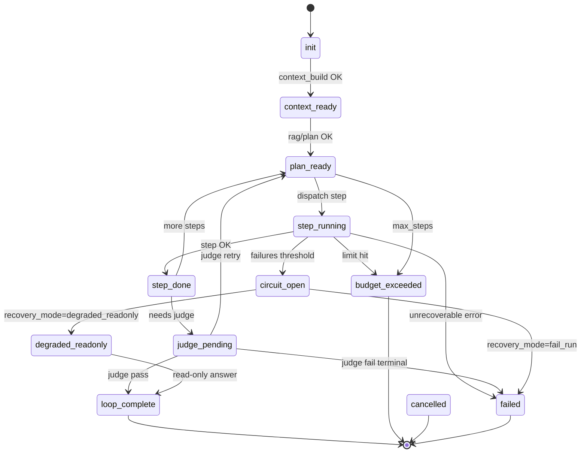
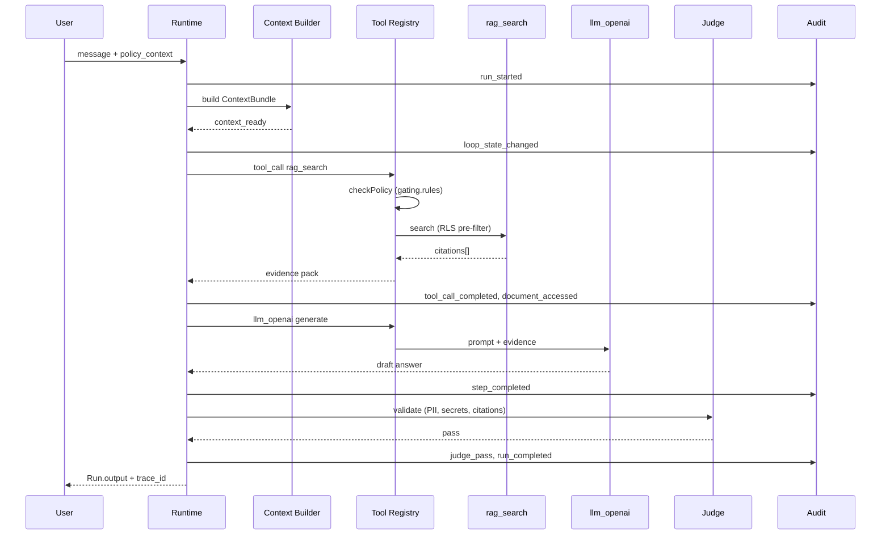

# TMKI AI Runtime

## Цель

TMKI AI Runtime — это набор модулей, которые обеспечивают воспроизводимую, аудируемую и безопасную работу “ИИ-агента” в продукте: сбор контекста, retrieval, вызовы инструментов, самопроверки (judge), применение guardrails и запись аудита.

## Принципы (MUST)

- **Детерминируемые контракты**: входы/выходы между модулями описаны и версионируются.
- **Аудитируемость по умолчанию**: каждое существенное решение и side-effect (tool call, доступ к данным, генерация ответа) пишет событие в аудит.
- **Минимальные привилегии**: контекст и инструменты получают ровно столько доступа, сколько нужно для шага.
- **Безопасность на сервере**: все проверки, влияющие на доступ к данным/инструментам, выполняются server-side.
- **Границы ответственности**: runtime не “угадывает” политику — он применяет policy из guardrails/конфигов.

## Основные сущности (контракты)

### Run

Один “запуск” пайплайна для пользовательского запроса (или фонового задания).

- **input**: сообщение пользователя, метаданные сессии, окружение (org/project), feature flags.
- **output**: финальный ответ и/или структурированный результат (например, action plan), ссылки на источники, trace id.

### Step

Атомарная стадия внутри Run (контекст, retrieval, tool call, judge и т. п.).

- **MUST** иметь: `step_id`, `type`, `started_at`, `ended_at`, `status`, `error?`.
- **SHOULD** иметь: `token_usage`, `model`, `policy_version`.

### Event (Audit)

Запись об изменении состояния/решении.

- **MUST**: `trace_id`, `run_id`, `step_id?`, `event_type`, `severity`, `actor` (user/system/service), `payload` (санитизированный).
- **MUST NOT**: хранить секреты в открытом виде.

### JSON Schema (v0.1)

Формальные контракты для реализации и валидации:

| Сущность | Schema | Пример |
|----------|--------|--------|
| Run | `schemas/runtime/run.schema.json` | `schemas/runtime/examples/run.example.json` |
| Step | `schemas/runtime/step.schema.json` | `schemas/runtime/examples/step.example.json` |
| Event | `schemas/runtime/event.schema.json` | `schemas/runtime/examples/event.example.json` |
| Loop State | `schemas/runtime/loop-state.schema.json` | `schemas/runtime/examples/loop-state.example.json` |
| Audit Catalog | `schemas/runtime/audit-event-catalog.json` | event_type, payload rules, sanitization |
| MVP Flow | `schemas/runtime/mvp-flow.json` | end-to-end stages, acceptance criteria |
| Общие типы | `schemas/runtime/common.schema.json` | `policy_context`, `token_usage`, `citation`, `budget`, `circuitBreakerConfig` |

`policy_context` в Run **MUST** соответствовать полям из `ORG_MODEL.md` (матрица RLS).

## Компоненты

Components:

- Context Builder
- Memory Tree
- Tool Registry
- Document Intelligence
- RAG
- Loop Engine
- Judge
- Guardrails
- Audit

### Context Builder

Собирает исходный контекст для модели/агента.

- **Вход**: user message, сессия, org/project, разрешения, краткая история диалога (см. `ORG_MODEL.md`).
- **Выход**: `ContextBundle` (структурировано, с лимитами размера).
- **MUST**: редактировать/маскировать PII/секреты согласно guardrails.

### Memory Tree

Долговременная память (предпочтения, факты, решения) с контролем качества.

- **MUST**: отделять “факты” от “гипотез” и хранить источник.
- **SHOULD**: иметь TTL/политику актуализации, чтобы не цементировать устаревшее.

### Tool Registry

Каталог доступных инструментов и политик доступа к ним.

- **MUST**: описывать интерфейс инструмента (вход/выход, side-effects, auth scope) — см. `16_tool_registry.md`.
- **MUST**: уметь отключать/ограничивать инструмент по policy (org, role, env) — см. `07_security_addendum.md`, `ORG_MODEL.md`.

### Document Intelligence

Преобразует документы в представление, пригодное для поиска/цитирования.

- **См.**: `09_document_processing.md`.

### RAG

Retrieval + формирование “evidence pack” для генерации ответа.

- **MUST**: возвращать не просто текст, а **цитируемые** фрагменты (doc id, offsets, url/path) — контракт чанков в `09_document_processing.md`.
- **SHOULD**: уметь hybrid search (BM25 + embeddings) при наличии — vector store см. `16_tool_registry.md`.

### Loop Engine

Оркестрация многошаговых задач (план → выполнение → проверка). Подробная state machine — ниже.

- **MUST**: ограничивать число шагов/время/стоимость (budget).
- **MUST**: прекращать цикл при повторяющихся ошибках (circuit breaker).
- **MUST**: записывать каждый переход состояния в Audit (`event_type` см. `schemas/runtime/event.schema.json`).
- **Schema**: `schemas/runtime/loop-state.schema.json`

#### Состояния Loop Engine

| `loop_state` | Описание |
|--------------|----------|
| `init` | Старт Run, budget и circuit breaker инициализированы |
| `context_ready` | Context Builder завершён |
| `plan_ready` | План шагов сформирован (loop_plan / LLM) |
| `step_running` | Выполняется Step (tool_call, rag, llm_generate) |
| `step_done` | Step успешно завершён |
| `judge_pending` | Ожидание/выполнение Judge |
| `loop_complete` | Цикл успешно завершён, ответ готов |
| `degraded_readonly` | Деградация: только read-only tools, без side-effects |
| `circuit_open` | Circuit breaker сработал |
| `budget_exceeded` | Превышен лимит steps/tokens/cost/time |
| `cancelled` | Отмена пользователем или системой |
| `failed` | Неустранимая ошибка |

#### Диаграмма переходов

#### Budget (MUST)

Лимиты задаются в `Run.input.budget` и **MUST** проверяться server-side перед каждым Step.

| Параметр | Default (production) | Default (development) | Действие при превышении |
|----------|----------------------|------------------------|-------------------------|
| `max_steps` | 10 | 15 | `budget_exceeded`, audit `budget_exceeded` |
| `max_tokens` | 32000 | 64000 | stop before next LLM call |
| `max_cost_usd` | 2.50 | 10.00 | stop before next paid call |
| `timeout_ms` | 120000 | 180000 | `stop_reason=timeout` |
| `max_step_duration_ms` | 60000 | 90000 | fail current step |
| `max_retries_per_step` | 2 | 3 | then count as step failure |

**SHOULD**: агрегировать `budget_consumed` в `loop-state` после каждого Step.

#### Circuit breaker (MUST)

Конфиг: `circuit_breaker` в loop-state (см. `common.schema.json#/$defs/circuitBreakerConfig`).

| Условие | Default threshold | Результат |
|---------|-------------------|-----------|
| Подряд неуспешных Step | 3 | `circuit_open` |
| Одинаковый `error.code` подряд | 2 | `circuit_open` |
| Сбои одного `tool_name` подряд | 2 | `circuit_open` |

При `circuit_open`:

- `recovery_mode=degraded_readonly` → переход в read-only (RAG/search без T_w), audit `circuit_breaker_tripped`
- `recovery_mode=fail_run` → `failed` с `stop_reason=circuit_breaker`

**MUST**: сбрасывать `consecutive_failures` после успешного Step.

#### Stop conditions (терминальные)

| `stop_reason` | Условие | Run.status |
|---------------|---------|------------|
| `judge_pass` | Judge одобрил финальный ответ | `completed` |
| `user_cancel` | Отмена сессии | `cancelled` |
| `budget_exceeded` | Любой лимит budget | `failed` или `completed`* |
| `circuit_breaker` | CB + fail_run | `failed` |
| `guardrail_block` | Guardrails block (terminal policy) | `failed` |
| `timeout` | `timeout_ms` Run | `failed` |
| `max_steps` | `step_index >= max_steps` без complete | `failed` |
| `unrecoverable_error` | Не retryable error | `failed` |

\* `budget_exceeded` MAY завершить с partial answer в `degraded_readonly`, если policy разрешает.

#### Связь со скиллом Looper

Процедура из `13_ai_skills_registry.md` (Looper) **SHOULD** следовать этой state machine.

### Judge

Самопроверка качества/безопасности результата перед выдачей.

- **MUST**: проверять соответствие policy (PII, секреты, запрещенные действия) — см. `07_security_addendum.md`, чеклисты в `13_ai_skills_registry.md`.
- **SHOULD**: проверять полноту ответа (например, выполнены ли requested outputs).

### Guardrails

Набор политик и фильтров, применяемых на каждом шаге.

- **MUST**: быть версионируемыми.
- **MUST**: иметь режимы `block / redact / warn`.

### Audit

Единый слой записи событий и трассировки.

- **MUST**: связывать всё через `trace_id`.
- **SHOULD**: поддерживать экспорт в наблюдаемость (лог/трейсы/метрики).
- **Каталог**: `schemas/runtime/audit-event-catalog.json` (v0.1).

#### Корреляция (MUST)

Каждое audit-событие **MUST** содержать:

| Поле | Назначение |
|------|------------|
| `trace_id` | Сквозная трассировка запроса (все Run/Step/Event одной сессии) |
| `run_id` | Конкретный Run |
| `event_id` | Уникальный id события |
| `occurred_at` | Время события (UTC) |
| `step_id` | Опционально — привязка к Step |

Запросы к логам **SHOULD** поддерживать фильтр `trace_id` для полного replay цепочки.

#### Severity (MUST)

| Severity | Когда использовать |
|----------|-------------------|
| `debug` | step_started, step_completed (высокий объём) |
| `info` | run_completed, tool_call_completed, document_accessed, judge_pass |
| `warning` | guardrail_block, policy_denied, budget_exceeded, judge_fail |
| `error` | run_failed, circuit_breaker_tripped |
| `critical` | компрометация policy, массовый deny (инцидент ИБ) |

#### Санитизация payload (MUST)

**MUST NOT** в `payload`:

- API keys, passwords, tokens, private keys
- Полные тела запросов с секретами
- Несанитизированные PII (паспорт, полный текст с персональными данными)

**SHOULD** редактировать: email, телефон, ФИО в user content → `[REDACTED]` или hash.

**ALLOWED**: `doc_id`, `project_id`, `tool_name`, `error_code`, `duration_ms`, token counts, `redacted_snippet`, `loop_state`, `policy_version`.

Детали: `audit-event-catalog.json` → `sanitization_rules`.

#### Каталог event_type (v0.1)

| event_type | Severity | Описание |
|------------|----------|----------|
| `run_started` | info | Run принят |
| `run_completed` | info | Успешное завершение |
| `run_failed` | error | Ошибка Run |
| `run_cancelled` | warning | Отмена |
| `step_started` | debug | Начало Step |
| `step_completed` | debug | Step OK |
| `step_failed` | warning | Step ошибка |
| `loop_state_changed` | info | Переход Loop Engine |
| `tool_call_requested` | info | Запрос tool |
| `tool_call_completed` | info | Tool OK |
| `tool_call_denied` | warning | Tool gating deny |
| `document_accessed` | info | Read/RAG доступ к doc |
| `document_ingested` | info | Ingest pipeline |
| `guardrail_block` | warning | Блокировка guardrails |
| `guardrail_redact` | info | Редакция PII/secrets |
| `guardrail_warn` | info | Предупреждение |
| `judge_pass` | info | Judge OK |
| `judge_fail` | warning | Judge reject |
| `policy_denied` | warning | RLS/ACL deny |
| `budget_exceeded` | warning | Лимит budget |
| `circuit_breaker_tripped` | error | Circuit breaker |

Поля `required_payload` / `forbidden_payload` per event — в `audit-event-catalog.json`.

#### Retention (SHOULD)

| Severity | Retention (ориентир) |
|----------|----------------------|
| debug | 7–14 дней |
| info | 90 дней |
| warning | 180 дней |
| error / critical | 1 год+ (или по политике ИБ) |

## MVP End-to-End (v0.1)

> **Phase 6 deliverable** — минимальный рабочий сценарий без write-tools.  
> Machine-readable: `schemas/runtime/mvp-flow.json`  
> Пример trace: `schemas/runtime/examples/mvp-run-trace.example.json`

### Референсный сценарий (Сатимол)

**Роль:** Chefmarkscheider (Литовский Д.)  
**Вопрос:** «Какие требования к маркшейдерской съёмке на участке КС?»  
**Ожидание:** ответ с цитатами из `doc_grd_0142`, `confidence=high`, полный audit trail.

### Sequence (happy path)

### Пошаговая спецификация (MUST для MVP)

| # | Модуль | Step type | Tool | loop_state | Audit events |
|---|--------|-----------|------|------------|--------------|
| 1 | Audit | — | — | `init` | `run_started` |
| 2 | Context Builder | `context_build` | — | `context_ready` | `loop_state_changed` |
| 3 | Loop Engine | — | — | `context_ready` | budget/cb init |
| 4 | Tool Registry | `tool_call` | `rag_search` | `step_running`→`step_done` | `tool_call_*`, `document_accessed` |
| 5 | RAG | — | — | — | citations в ContextBundle |
| 6 | Tool Registry | `llm_generate` | `llm_openai` | `step_running`→`step_done` | `step_completed` |
| 7 | Judge | `judge` | — | `judge_pending`→`loop_complete` | `judge_pass` |
| 8 | Audit | — | — | `loop_complete` | `run_completed` |

### MVP scope (включено)

- Context Builder + `policy_context` из сессии
- RAG через `rag_search` с server-side RLS
- Tool gating (`tool-gating.rules.json`)
- Guardrails pre/post LLM (PII, secrets)
- Judge (Security Review checklist)
- Полный audit по `trace_id`
- Budget limits (default production)
- Деградация: empty RAG → low confidence answer

### MVP scope (исключено)

- Memory Tree read/write
- Write tools (T_w) и user confirmation flow
- Multi-step Loop plan (loop_plan > 1 iteration)
- Local LLM provider
- Camofox / watchlist tools в production

### Acceptance criteria (MUST)

1. Один `trace_id` — полная цепочка Event в audit.
2. `policy_context` формируется server-side, не из LLM output.
3. RAG фильтрует по RLS **до** передачи в LLM.
4. `tool_call_denied` при нарушении gating — без `execute()`.
5. `Run.output.citations[]` при успешном RAG.
6. `guardrail_block` — ответ не уходит пользователю.
7. `Run.status=completed` только после `judge_pass`.
8. MVP security-review checklist signed off (`schemas/security/`) перед production deploy.

### Деградационные ветки (SHOULD)

| Триггер | Поведение |
|---------|-----------|
| RAG empty / denied | LLM без citations, `confidence=low`, предложить уточнить |
| `circuit_breaker_tripped` | `degraded_readonly`, только RAG/search |
| `judge_fail` (1 раз) | retry `llm_generate`, затем `failed` |
| `budget_exceeded` | stop, partial answer если policy разрешает |

## Типовой поток (высокоуровнево)

1) **Context Builder** формирует `ContextBundle`.
2) **RAG** (опционально) добавляет доказательства/источники.
3) **Loop Engine** выполняет план (tool calls) под контролем **Guardrails**.
4) **Judge** валидирует финальный ответ.
5) **Audit** фиксирует события на каждом шаге.

## Ошибки и деградация (SHOULD)

- Если недоступны инструменты → отвечать в “read-only” режиме без side-effects.
- Если retrieval пуст/сомнителен → явно сообщать об уверенности и просить уточнение/источник.
- При подозрении на секрет/PII → редактировать и логировать событие guardrails.

## Связанные документы

| Документ | Связь |
|----------|-------|
| `07_security_addendum.md` | RLS, guardrails, audit, rate limits, tool gating |
| `09_document_processing.md` | Document Intelligence, чанки, embeddings |
| `16_tool_registry.md` | контракты и approved-инструменты |
| `schemas/tools/` | tool-definition, providers.registry.json, tool-gating.rules.json |
| `ORG_MODEL.md` | org/project/role context, RLS-поля |
| `13_ai_skills_registry.md` | процедуры Loop Engine, Security Review |
| `18_technology_watch.md` | approved модели, провайдеры, пересмотр стека |
