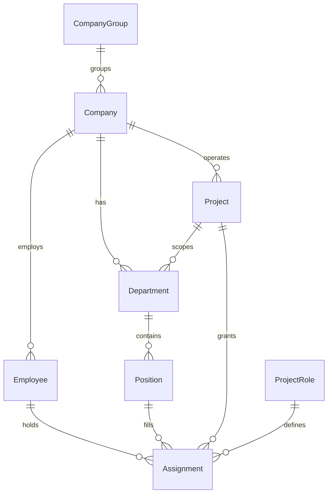

# Org Model

## Базовая модель (абстракция)

```text
Company -> Department -> Position -> Employee
Project -> ProjectRole -> Employee
```

- **Company** — юридическое лицо или операционная единица (офис, филиал).
- **Department** — структурное подразделение внутри компании/проекта.
- **Position** — должность (роль в оргструктуре).
- **Employee** — конкретный сотрудник, назначенный на должность.
- **Project** — проектная сущность (например, строительство шахты).
- **ProjectRole** — проектная роль (ГИП, руководитель проекта, начальник участка и т. п.).
- **Assignment** — назначение сотрудника на должность и/или проектную роль (с датами действия).

## Схема сущностей (v0.1)

> Roadmap #8 — JSON Schema в `schemas/org/`. Пример снимка Сатимол: `schemas/org/examples/satimol-snapshot.example.json`.



| Сущность | Schema | Ключевые поля |
|----------|--------|---------------|
| Company | `company.schema.json` | `company_id`, `company_type`, `company_group_id` |
| Department | `department.schema.json` | `department_id`, `company_id`, `project_id?`, `parent_department_id?` |
| Position | `position.schema.json` | `position_id`, `department_id`, `status` (incl. `vacant`) |
| Employee | `employee.schema.json` | `employee_id`, `clearance`, `contractor_id?` |
| Project | `project.schema.json` | `project_id`, `primary_company_id` |
| ProjectRole | `project-role.schema.json` | `role_key` → `policy_context.project_role` |
| Assignment | `assignment.schema.json` | `position` / `project_role` / `group_grant` |

**MUST**: `policy_context` в runtime собирается из активных `Assignment` на дату запроса (server-side).

## Источник оргструктуры (проект «Сатимол»)

Оригинал: `Орг Структура Сатимола_проект_10092025.vsdx` (Visio, дата схемы: 10.09.2025).

Схема описывает оргструктуру проекта **Сатимол** с привязкой к юрлицам TMKI/Thyssen и проектным ролям.

## Верхний уровень

| Уровень | Сущность | Примечание |
|--------|----------|------------|
| Группа | SchBK — Gen. Direktor / Hauptgeschäftsführer | Хюбшер С. |
| Юрлицо (DE) | Thyssen Schachtbau GmbH (Deutschland) | Sch NORDHAUSEN, буровые работы / Bohren |
| Юрлицо (RU) | ООО «ТМКИ» / Thyssen Mining Construction East | Московский офис, проектные подразделения |
| Офис (DE) | ТБ Мюльхайм / TB Mülheim | РД и ПОР |
| Офис (KZ) | Перспективный офис в г. Уральск | — |

## Ключевые проектные роли

| ProjectRole | RU | DE | ФИО (по схеме) |
|-------------|----|----|----------------|
| Direktor | Директор | Direktor | Каледин О.С. |
| Projektleiter | Руководитель проекта | Projektleiter | Нефф А. |
| Projektleiter (Design) | Руководитель проекта (проектные работы) | Projektleiter (Design) | Хофманн С. |
| ГИП | Главный инженер проекта (ГИП) | — | Дядин С., Гаер Д. |
| Главный инженер проекта | — | — | Пасечник И. |
| Generalprojektant | КГЦМ (генпроектировщик ПД/РД) | Generalprojektant | — |
| Chefgeologe | Главный геолог | Chefgeologe | вакансия |
| Chefmarkscheider | Главный маркшейдер | Chefmarkscheider | Литовский Д. |
| Hauptingenieur | Главный инженер | — | — |

## Подразделения ООО «ТМКИ» (проект «Сатимол»)

### Управление и администрация

- Административно-управленческий персонал
- Секретариат
- Бухгалтерия / Buchhaltung
- Отдел кадров / Personalabteilung
- Планово-экономический отдел
- Аналитический отдел / Plannungsabteilung
- Служба охраны труда и промышленной безопасности

### Инженерные и проектные службы

- Служба главного инженера / Hauptingenieur Abteilung
- Производственно-технический отдел (ПТО)
- Группа рабочего проектирования
- Отдел технического контроля (Лаборатория) / Technische Kontrollabteilung (Bau Labor)
- Геологический отдел / Geologische Abteilung
- Маркшейдерская служба / Markscheider Abteilung
- Отдел связи и информационного обеспечения

### Производственные участки

- Участок буровзрывных работ (БВР)
- Участок подземных работ КС
- Участок подземных работ СС
- Строительно-монтажный участок (СМУ)
- Замораживающий комплекс

### Техническое обеспечение

- Отдел главного энергетика
- Отдел главного механика
- Механический цех
- Автотранспортный отдел
- Отдел материально-технического снабжения / Einkaufsabteilung

### Инфраструктура и подряд

- Вахтовый поселок (комендант, переводчик, секретарь и др.)
- Прочие подрядчики / andere Auftragnehmer (перечень по факту составления ГРД / MDR / ВОКРЧ)
- Инженерные изыскания под времянки (ТОО Казгеосфера)
- Инженер по охране окружающей среды / Umweltschutzingenieur

## Связь с доступами (RLS / policy)

Для runtime и БД рекомендуется маппинг:

| Сущность оргмодели | Поле/контекст в системе | Назначение |
|--------------------|-------------------------|------------|
| Company | `company_id` | изоляция юрлиц (ТМКИ, Schachtbau и т. п.) |
| Department | `department_id` | RLS по подразделению |
| Project | `project_id` | проект «Сатимол» и др. |
| ProjectRole | `project_role` | права на инструменты и документы |
| Employee | `employee_id` / `user_id` | субъект доступа |
| Classification | `access_label` / `classification` | уровень конфиденциальности документов (см. ниже) |
| Contractor org | `contractor_id` | юрлицо/контрагент подрядчика (MAY ≠ `company_id` TMKI) |
| Company group | `company_group_id` | группа SchBK (сквозной scope для `group_admin`) |

**MUST**: доступ к документам и tool calls фильтруется по `company_id`, `project_id`, `department_id` и роли сотрудника (см. `07_security_addendum.md`, `10_ai_runtime.md`).

## Матрица «роль → права → RLS» (проект «Сатимол»)

> Статус: **v0.2** — матрица + решения по открытым вопросам (roadmap #7).  
> Основа: оргсхема 10.09.2025. Реализация — **server-side** (RLS + policy engine).

### Легенда действий

| Код | Значение |
|-----|----------|
| **R** | read (чтение) |
| **W** | write (создание/изменение в своём scope) |
| **A** | admin (управление доступами, policy, назначения) |
| **T_r** | tool call read-only (RAG, search, web read) |
| **T_w** | tool call с side-effects (write/API/интеграции) |
| **I** | ingest / индексация документов |
| **—** | запрещено |

### Ресурсы системы

| Resource ID | Описание | Ключевые RLS-поля |
|-------------|----------|-------------------|
| `doc.project` | Проектная документация (ПД/РД/ГРД, общие регламенты) | `project_id`, `access_label` |
| `doc.department` | Документы подразделения / участка | `project_id`, `department_id`, `access_label` |
| `doc.confidential` | HR, финансы, персональные данные | `company_id`, `access_label` ≥ restricted |
| `doc.external` | Документы подрядчиков | `project_id`, `access_label`, contractor flag |
| `runtime.chat` | AI Run / чат с агентом | `project_id`, `project_role` |
| `runtime.tool` | Вызовы инструментов (см. `16_tool_registry.md`) | `project_role`, env, risk class |
| `runtime.audit` | Журнал аудита | `company_id`, `project_id` (read scoped) |
| `org.assignments` | Назначения ролей и доступов | `company_id`, `project_id` |

### Scope-правила RLS (MUST)

| Scope | SQL/policy смысл | Применение |
|-------|------------------|------------|
| **S_project** | `project_id = current_user.project_id` | Все участники проекта «Сатимол» |
| **S_company** | `company_id = current_user.company_id` | Внутри юрлица (ТМКИ и т. п.) |
| **S_dept** | `department_id = current_user.department_id` | Только своё подразделение |
| **S_dept_tree** | `department_id IN user.dept_tree` | Подразделение + подчинённые участки |
| **S_label** | `doc.access_label <= user.clearance` | Классификация конфиденциальности |
| **S_self** | `employee_id = current_user.employee_id` | Только свои записи |

**MUST**: фильтрация `S_label` и `S_project` применяется **до** выдачи в RAG (см. `09_document_processing.md`).

### Матрица по проектным ролям

| ProjectRole | doc.project | doc.department | doc.confidential | doc.external | runtime.chat | T_r | T_w | I | runtime.audit | org.assignments |
|-------------|:-----------:|:--------------:|:----------------:|:------------:|:------------:|:---:|:---:|:---:|:-------------:|:---------------:|
| **Direktor** | R+W `S_project`+`S_label` | R `S_project` | R `S_company`+`S_label` | R `S_project` | R+W | ✓ | ✓* | ✓ | R `S_project` | A `S_project` |
| **Projektleiter** | R+W `S_project` | R+W `S_dept_tree` | R `S_company`† | R `S_project` | R+W | ✓ | ✓* | ✓ | R `S_project` | W‡ |
| **Projektleiter (Design)** | R+W `S_project` | R `S_project`¹ / W `S_dept` | — | R `S_project` | R+W | ✓ | ✓* | ✓ | R `S_dept` | — |
| **ГИП / Гл. инж. проекта** | R+W `S_project` | R+W `S_dept_tree` | — | R `S_project` | R+W | ✓ | ✓* | ✓ | R `S_dept_tree` | — |
| **Generalprojektant (КГЦМ)** | R+W `S_project` | R `S_project` | — | R `S_project` | R+W | ✓ | — | ✓ | — | — |
| **Начальник подразделения**§ | R `S_project` | R+W `S_dept` | — | R `S_dept` | R+W | ✓ | ✓* | ✓ `S_dept` | R `S_dept` | — |
| **Начальник участка** (БВР/КС/СС/СМУ) | R `S_project` | R+W `S_dept` | — | — | R+W | ✓ | — | ✓ `S_dept` | — | — |
| **Служба ОТ и ПБ** | R `S_project` | R `S_project` | — | — | R | ✓ | — | R | R `S_project` | — |
| **Бухгалтерия / Кадры** | — | R `S_dept` | R+W `S_dept`¶ | — | R | ✓ | — | — | — | — |
| **МТО / Закупки** | R `S_project` | R+W `S_dept` | — | R `S_project` | R+W | ✓ | ✓* | ✓ `S_dept` | — | — |
| **ИТ / Связь** | R `S_project` | R `S_dept` | — | — | R+W | ✓ | ✓** | ✓ | R `S_project` | W** |
| **Секретариат / АУП** | R `S_project` | R `S_dept` | — | — | R | ✓ | — | R | — | — |
| **Подрядчик (external)** | R‖ | R‖ | — | R‖ | R | ✓ | — | — | — | — |
| **group_admin** (SchBK) | R `S_project`² | R `S_project`² | R `S_company`²†† | R `S_project`² | R | ✓ | — | — | R `S_company` | A `S_company` |

**Примечания к матрице:**

- ¹ **Projektleiter (Design)**: read `doc.department` по всему проекту (`S_project`); write — только своё подразделение (`S_dept`). Смешанные чертежи — через `doc.project`, не через чужие `department_id`.

- \* **T_w** — только с guardrails + audit; write-операции MAY требовать подтверждения пользователя (см. `07_security_addendum.md`).
- † Projektleiter: финансы/HR — read сводных отчётов, без персональных данных уровня `restricted`.
- ‡ Назначение ролей в пределах проекта, без изменения `company_id`-level policy.
- § Начальник ПТО, геологии, маркшейдерии, лаборатории, главный механик/энергетик и т. п.
- ¶ Только в scope своего подразделения (`S_dept`); персональные данные — минимально необходимый набор.
- \*\* ИТ: T_w/I для инфраструктурных инструментов; без доступа к `doc.confidential` по умолчанию.
- ‖ Подрядчик: доступ только к документам с явным `contractor_id` / share flag; `project_id` обязателен.

### Tool gating по ролям (связь с `16_tool_registry.md`)

| Категория tool | Direktor / Projektleiter | ГИП / Нач. подразделения | Design / КГЦМ | Участки / АУП | Подрядчик |
|----------------|--------------------------|---------------------------|---------------|---------------|-----------|
| LLM (OpenAI/Anthropic/Local) | ✓ | ✓ | ✓ | R-only† | R-only† |
| RAG / pgvector | ✓ | ✓ scoped | ✓ | ✓ scoped | ✓ scoped‖ |
| Web (SearXNG, Firecrawl) | ✓ | ✓ | ✓ | ✓ | — |
| OCR / ingest (MinerU) | ✓ | ✓ `S_dept` | ✓ | ✓ `S_dept` | — |
| Write/API integrations | ✓* | ✓* | — | — | — |

† Без T_w без явного разрешения policy. ‖ Только shared docs.

### Контекст Context Builder (поля сессии)

При старте Run **MUST** передаваться в policy context:

```json
{
  "company_id": "...",
  "company_group_id": "schbk",
  "project_id": "satimol",
  "department_id": "...",
  "project_role": "Projektleiter",
  "employee_id": "...",
  "contractor_id": null,
  "clearance": "internal",
  "env": "production"
}
```

`contractor_id` — MUST для `project_role` = `Подрядчик (external)`.  
`company_group_id` — MUST для `group_admin`.

- ‖ Подрядчик: доступ только при `contractor_id` + явный share (см. §Подрядчики).
- †† **group_admin**: сводные HR/финансы без построчного PII; детализация — по отдельному grant.

### Уровни `access_label` / `classification` (MUST)

Синонимы в коде: поле документа `access_label` = `classification` в ingest (см. `schemas/document/`).

| Уровень | Порядок | Примеры (Сатимол) | Кто MAY видеть (min clearance) |
|---------|---------|-------------------|--------------------------------|
| `public` | 0 | публичные справки, общие ГОСТ без ограничений | все роли проекта |
| `internal` | 1 | внутренняя переписка, ПТО, производственные отчёты | `internal`+ |
| `restricted` | 2 | маркшейдерия, геология, сметы с коммерческими условиями | `restricted`+ |
| `confidential` | 3 | HR, персональные данные, зарплата, договоры с NDA | `confidential`+ |

**MUST**: порядок `public < internal < restricted < confidential` (см. `09_document_processing.md` §7).  
**MUST**: `user.clearance` в `policy_context` — тот же enum; назначается владельцем ИБ при онбординге.

### Подрядчики (MUST)

| Поле | Правило |
|------|---------|
| `contractor_id` | Стабильный ID юрлица подрядчика (MAY ≠ `company_id` TMKI) |
| `project_role` | `Подрядчик (external)` — гостевая роль в проекте |
| `company_id` в сессии | Юрлицо подрядчика (для audit), `project_id` обязателен |
| Доступ к `doc.*` | `doc.contractor_id = user.contractor_id` **ИЛИ** `user.contractor_id IN doc.shared_with_contractor_ids` |
| RLS | `project_id` совпадает; **без** `S_dept_tree`; ingest/OCR — запрещены (см. матрицу) |
| Share | Выдача документа подрядчику — явное действие Projektleiter+ с audit `document_shared` |

### Роль `group_admin` (SchBK) (MUST)

| Аспект | Решение |
|--------|---------|
| Назначение | SchBK / Gen. Direktor — `project_role`: `group_admin`, `company_group_id`: `schbk` |
| Область | Сквозное чтение по юрлицам группы (ТМКИ, Thyssen Schachtbau) **в рамках выданных проектов** |
| Ограничение | Нет автоматического доступа ко всем `confidential` / всем проектам; межпроектный доступ — через grant в `org.assignments` |
| T_w / ingest | Запрещены по умолчанию; только чтение + аудит сводок |
| Пример | Хюбшер С. — `group_admin`, clearance `restricted` (не `confidential` без отдельного grant) |

### Решения по открытым вопросам (v0.2)

| # | Вопрос | Решение |
|---|--------|---------|
| 1 | Уровни `access_label` | Утверждены 4 уровня (таблица выше); согласованы со схемой ingest |
| 2 | Projektleiter (Design) и смежные подразделения | Чтение `doc.department` = `S_project`; запись = только `S_dept` |
| 3 | SchBK / group_admin | Отдельная роль `group_admin` + `company_group_id`; межпроектные grants обязательны |
| 4 | Подрядчики | Отдельный `contractor_id`, гостевая `project_role`, share-list на документе |

**SHOULD**: пересмотр решений при смене оргсхемы или инциденте доступа — владельцы: ИБ + Projektleiter.

## Связанные документы

| Документ | Связь |
|----------|-------|
| `07_security_addendum.md` | RLS, серверная авторизация |
| `10_ai_runtime.md` | Context Builder, tool gating по роли |
| `09_document_processing.md` | классификация, фильтрация документов |
| `16_tool_registry.md` | policy hooks по org/role/env, `tool-gating.rules.json` |
| `schemas/org/` | JSON Schema сущностей и пример Сатимол |

## Статус вакансий (v0.1, оргсхема 10.09.2025)

> Roadmap #9. Источник: `Орг Структура Сатимола_проект_10092025.vsdx`.  
> В системе учёта: `Position` со `status: vacant` — см. `position.schema.json`, пример в `satimol-snapshot.example.json`.

| `position_id` | Подразделение | Должность | Статус | Срочность | Назначен (по схеме) |
|---------------|---------------|-----------|--------|-----------|---------------------|
| `pos_pto_head` | ПТО | Начальник ПТО | **вакансия** | срочно | — |
| `pos_geology_head` | Геологический отдел | Главный геолог (Chefgeologe) | **вакансия** | ближайшее время | — |
| `pos_lab_qc` | Лаборатория (ОТК) | Инженер по контролю качества | **вакансия** | планово | — |
| `pos_bvr_head` | Участок БВР | Начальник участка | **вакансия** | планово | — |
| `pos_ks_head` | Участок подземных работ КС | Начальник участка | **вакансия** | планово | — |
| `pos_ss_head` | Участок подземных работ СС | Начальник участка | **вакансия** | планово | — |
| `pos_smu_head` | СМУ | Начальник участка | **вакансия** | планово | — |
| `pos_smu_deputy_gc` | СМУ | Зам. по общестроительным работам | **вакансия** | планово | — |
| `pos_hauptingenieur` | Служба главного инженера | Hauptingenieur / Главный инженер | уточнить | — | — |
| `pos_generalprojektant` | КГЦМ | Generalprojektant | уточнить | — | — |
| `pos_chefmarkscheider` | Маркшейдерская служба | Chefmarkscheider | занято | — | Литовский Д. |
| `pos_projektleiter` | Управление проекта | Projektleiter | занято | — | Нефф А. |
| `pos_gip` | Служба ГИП | ГИП | занято | — | Дядин С., Гаер Д. |

**MUST**: для вакантных `position_id` не создавать активный `Assignment` типа `project_role` до найма.  
**SHOULD**: при закрытии вакансии обновить таблицу и `schemas/org/examples/satimol-snapshot.example.json`.
